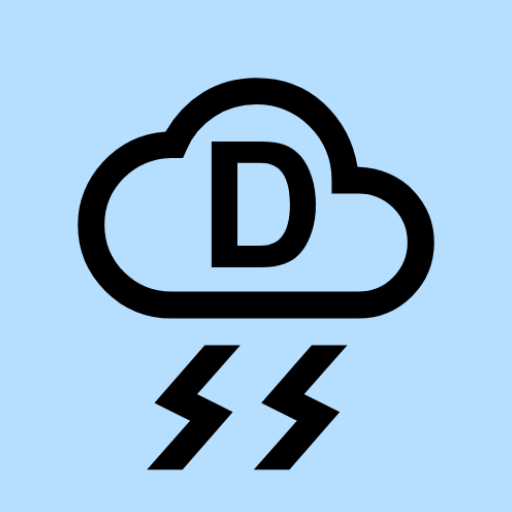

<h1 style="color:#0000AA;padding-left:100px">Weather Station Donna</h1>
 

## Weather Station Donna for Android
The Weather Station Donna application fetches and displays weather information from one specific Davis Vantage Vue aka "Weather Station Donna" in Hot Springs Arkansas. If you are reading this you probably should uninstall this application, because it is really just meant for the use of Donna and family members. If you still want to play with it, then please read on.

## Privacy Policy
* Developer information and a privacy point of contact or a mechanism to submit inquiries:
    - Developed by RKDAW Enterprises and Ralph Williamson
    - Contact via email at rkdawenterprises@gmail.com.
* Disclosing the types of personal and sensitive user data your app accesses, collects, uses, and shares; and any parties with which any personal or sensitive user data is shared:
    - This app does not access, collect, use, or share any personal or sensitive user data.
    - Personal or sensitive user data is not shared with any parties.
* Secure data handling procedures for personal and sensitive user data:
    - Personal or sensitive user data is not handled.
* The developer's data retention and deletion policy:
    - Personal or sensitive user data is not retained.

## Contact/Bugs
Enter bugs at [Weather Station Donna Issues](https://github.com/rkdawenterprises/weatherstationdonna/issues).

You can email me at <a href="mailto:&#109;&#97;&#105;&#108;&#116;&#111;&#58;rkdawenterprises&#64;gmail&#46;com&#46;no!spam?subject=Brief Editor Emulation for IntelliJ IDEA">rkdawenterprises&#64;gmail&#46;com&#46;no!spam</a>. I don't look at this very often so it may take a while to hear back.

## License
Copyright 2019-2024 RKDAW Enterprises and Ralph Williamson

Licensed under the Apache License, Version 2.0 (the "License"); You may not use this file except in compliance with the License.

You may obtain a copy of the License at [Apache License Verson 2.0](http://www.apache.org/licenses/LICENSE-2.0).

Unless required by applicable law or agreed to in writing, software distributed under the License is distributed on an "AS IS" BASIS,
WITHOUT WARRANTIES OR CONDITIONS OF ANY KIND, either express or implied. See the License for the specific language governing permissions and
limitations under the License.

---
Plugin based on the [IntelliJ Platform Plugin Template](https://github.com/JetBrains/intellij-platform-plugin-template).
